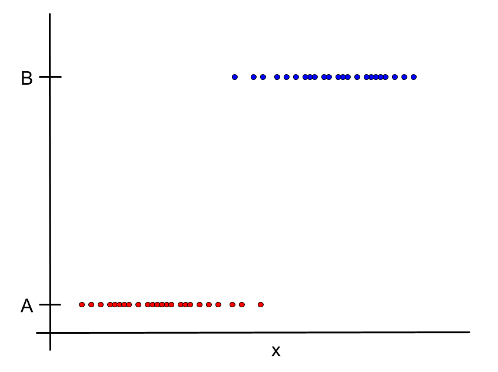
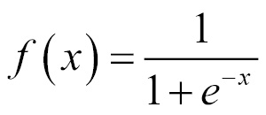
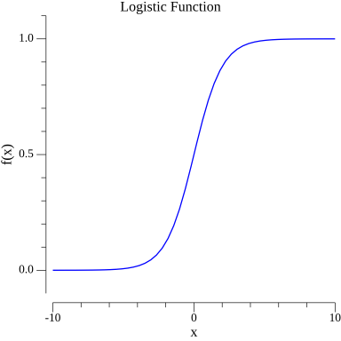

# Logistic Regression

Let's say that we have two classes, A and B, that we are trying to predict.
Let's also suppose that we are trying to predict A or B based on a variable x.

We need some function that goes to and stays at A for low values of x,
and goes to and stays at B for higher values of x.

There is such a function. The function is called the logistic function, and it gives logistic regression its name.
It has the following form:

Plot this function

