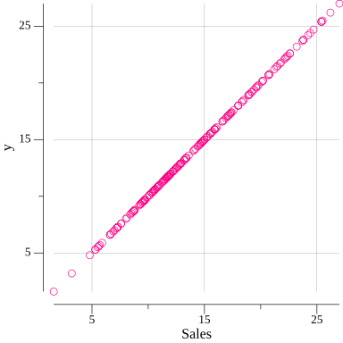

# Profiling the data


see that not all of our variables are normally distributed (that is, they are in a bell shape).
The sales might be somewhat bell-shaped, but the others do not look to be normal.

# Choosing our independent variable
Visually exploring the correlation between the dependent variable and all of the choices that you have for independent variables.




both Radio and TV appear to be somewhat linearly correlated with Sales.
The linear relationship with TV seems most obvious
```
sales = m*TV + b
```

# Train the model
Predicted = 7.0688 + TV*0.0489

# Visualize regression line


# Multiple regression
Sales = m1 * TV + m2 * Radio + b

