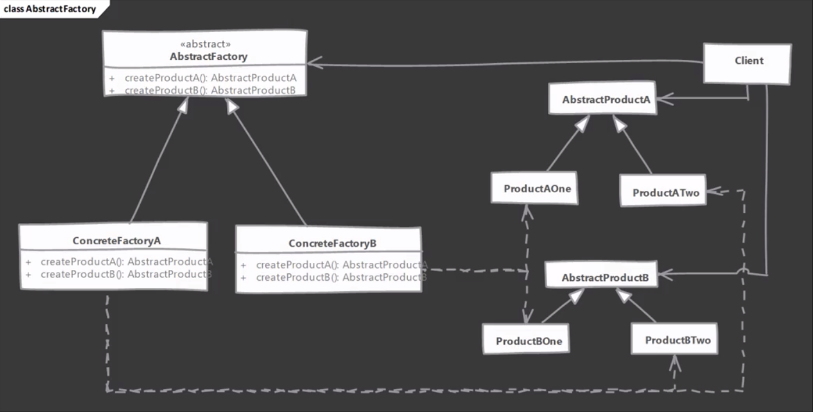

# Abstract Factory Design Pattern

## Overview
Abstract factory is used when we have two or more objects which work together as a kit or set and there can be multiple sets or kits that can be created by the client code
So we separate client code from concrete objects forming such a set and also from the code which creates these sets.

## Example Implementations
* [Example 1](example1/README.md)
* [Example 2](example2/README.md)

## Design Considerations
When you want to constrain object creations so that they work together, then abstract factory is good design pattern.
If objects are expensive to create, then you can transparently switch factory implementations to use prototype design pattern.