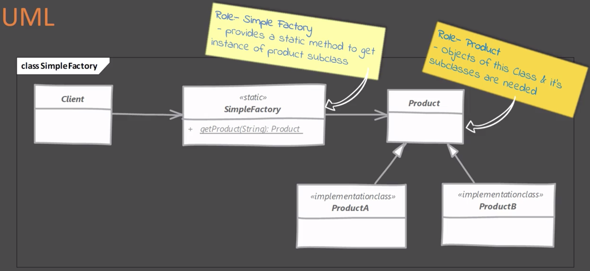
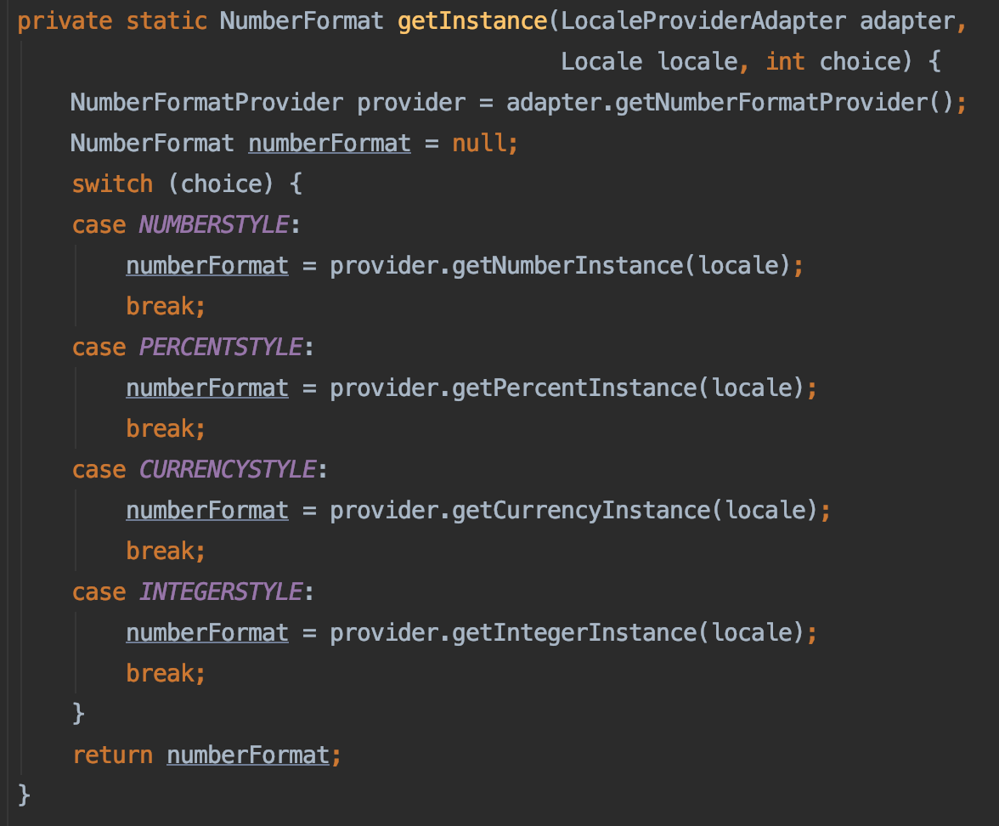

# Simple Factory Design Pattern

## Overview
In simple factory pattern, we have a factory class which has a method that returns different types of object based on given input.
We simply move our instantiation logic away from the client code.

## Example Implementations

## Real World Implementations
* java.text.NumberFormat

## Pitfalls
The criteria used by simple factory to decide which object to instantiate can get more complex over time. If you find yourself in such a situation, then use the [Factory Method](../factorymethod/README.md) design pattern instead